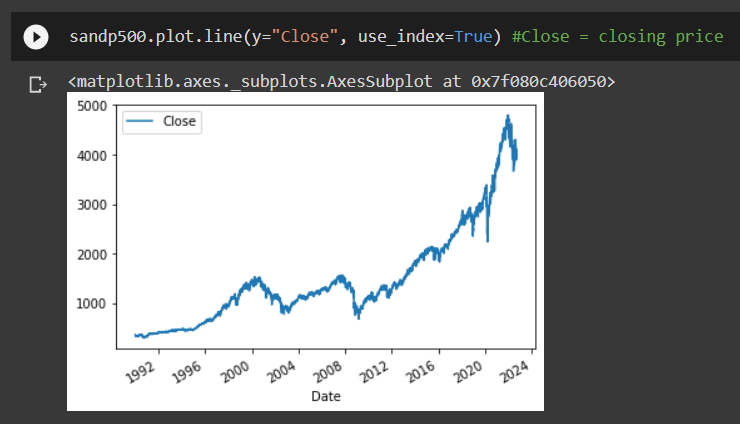
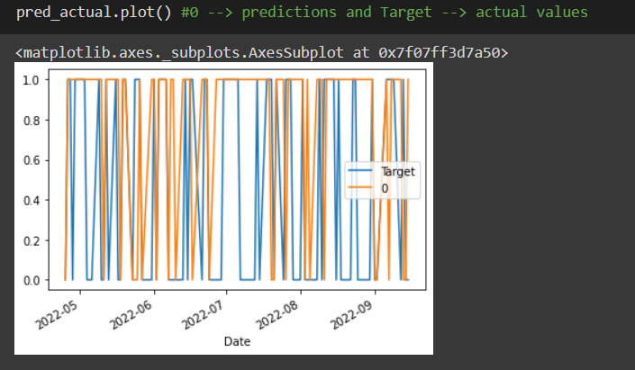
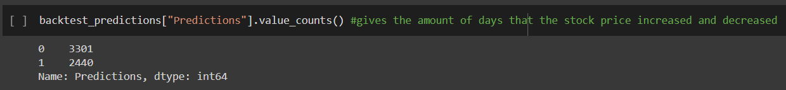
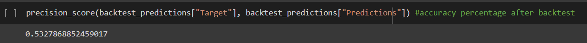
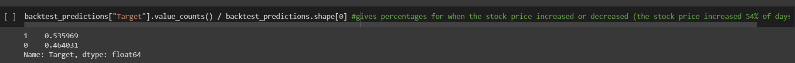
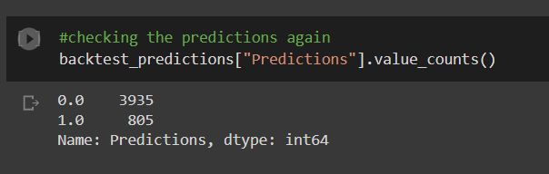
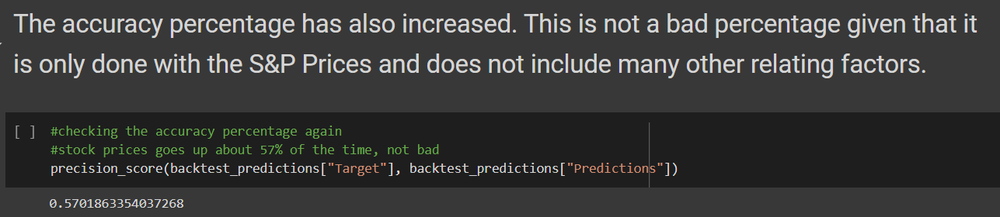

# Stock Market Prediction Application

A machine learning application that predicts if the stock market price will increase or decrease using historical data. Using the S&P 500 Index data from yahoo finance, the model is trained to find non-linear relationships with the target price. To deal with overfitting, minimize error, and obtain better accuracy, backtesting is implemented where you continually train years of data and then predict the following year's data. This process essentially repeats to ensure that the model is trained for better accuracy. Example: train with 10 years of data and predict the 11th year --> train with 11 years of data then predict the 12th year --> etc. To further obtain a better accuracy, this application uses precise predictors that don't use absolute numbers. From here, it uses ratios and rolling averages to compare today's market prices with the market price from different days ago. It is key to check the close price in the last two days, week, three months, year, four years, etc.

# References 
Dataquest
